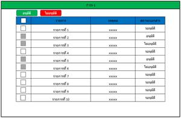
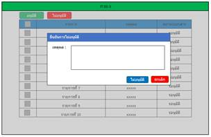

# Interview Question 003 — Document Approval (IT 03-1)

> Source: `Obsidian Vault/interview-question-003.md`. This file is a cleaned-up,
> developer-facing restatement of the original (Thai) exam brief.

## Ground rules

- **Company context:** Name the website and all packages/namespaces as if you work at **`example.com`**
  (e.g. `com.example.*`, `github.com/example/...`, `Example.It03.*`).
- **Tech stack:** Build the program as a web application with a **Golang** backend and an **Angular**
  frontend, ensuring high performance, scalability, and code quality.
  (The original brief also lists C# .NET; for this implementation the backend is **Go**.)
- **Database:** Design the schema as you see fit. Seed it with **mockup data**.
- **Deliverable:** A program with a UI that behaves exactly as described below.

---

## Objective

Build a document-approval screen (**IT 03-1**) where a reviewer can approve or reject pending
documents. Each document has one of three approval statuses:

| Status (TH)   | Meaning            |
| ------------- | ------------------ |
| `รออนุมัติ`   | Pending approval   |
| `อนุมัติ`     | Approved           |
| `ไม่อนุมัติ`  | Rejected / Not approved |

**Rule:** Once a document has been approved, it **cannot be approved again** (the action must be
disabled/locked for items that are no longer pending).

---

## Screen 1 — IT 03-1 (list page)

- Title bar: **IT 03-1**.
- Two action buttons (top-left): **อนุมัติ** (Approve, green) and **ไม่อนุมัติ** (Reject, red).
- A table with the columns:
  1. **Select** — checkbox per row (disabled for rows that are not pending).
  2. **รายการ** — item name (`รายการที่ 1` … `รายการที่ 10`).
  3. **รหัส** — code (`xxxxx`, mockup).
  4. **สถานะการอนุมัติ** — approval status (one of the three statuses above).
- Mockup data: ~10 rows with a mix of pending / approved / rejected states.

### Behaviour

1. The user **selects a pending row**, then clicks **อนุมัติ (Approve)** → opens the **IT 03-2** modal.
2. The user **selects a pending row**, then clicks **ไม่อนุมัติ (Reject)** → opens the **IT 03-3** modal.
3. Rows that are already approved/rejected cannot be selected for the same action again.

---

## Screen 2 — IT 03-2 (approve modal)

- Title: **ยืนยันการอนุมัติ** (Confirm approval).
- A **เหตุผล (reason)** text area for the approver to enter the approval reason.
- Buttons:
  - **อนุมัติ (Approve, blue):** update the document status to **อนุมัติ (Approved)** (persist the reason), then close the modal and refresh the list.
  - **ยกเลิก (Cancel, red):** close the modal without changing anything.

---

## Screen 3 — IT 03-3 (reject modal)

- Title: **ยืนยันการไม่อนุมัติ** (Confirm rejection).
- A **เหตุผล (reason)** text area for the approver to enter the rejection reason.
- Buttons:
  - **ไม่อนุมัติ (Reject, blue):** update the document status to **ไม่อนุมัติ (Rejected)** (persist the reason), then close the modal and refresh the list.
  - **ยกเลิก (Cancel, red):** close the modal without changing anything.

---

## Acceptance checklist

- [ ] IT 03-1 list renders 10 mockup rows with the three possible statuses.
- [ ] Approve / Reject buttons act on the selected pending row.
- [ ] Approving opens IT 03-2, captures a reason, and sets status → `อนุมัติ`.
- [ ] Rejecting opens IT 03-3, captures a reason, and sets status → `ไม่อนุมัติ`.
- [ ] Cancel on either modal closes it with no state change.
- [ ] An already-approved (non-pending) document cannot be approved again.
- [ ] Status changes persist to the database (Go backend) and survive a page reload.
- [ ] Naming throughout uses the `example.com` company convention.

## Notes

- Database structure is designed as appropriate; data is mockup.
- Original UI labels are Thai; preserve them in the UI.
