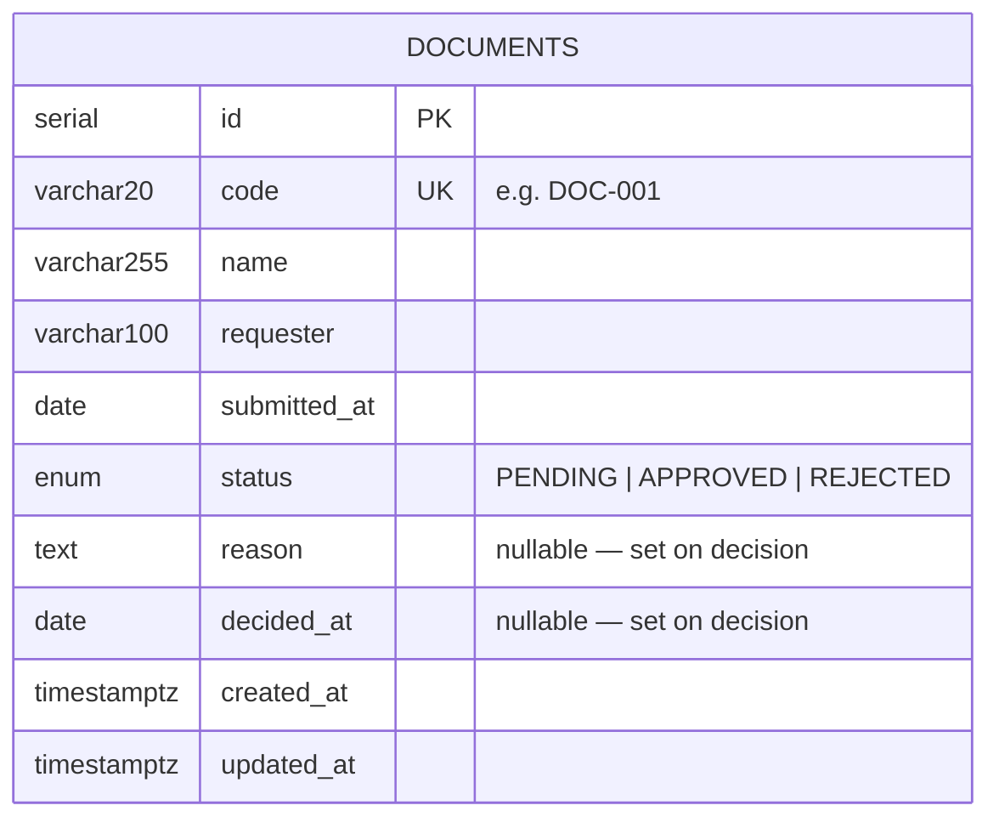

# ER Design — IT 03 Document Approval

## Entity Relationship

Single-table design. The `reason` and `decided_at` columns are `NULL` while `status = PENDING`
and populated atomically when a decision is recorded.

---

## REST API surface (Phase 3 contract)

| Method | Path                        | Body                                         | Description               |
|--------|-----------------------------|----------------------------------------------|---------------------------|
| GET    | `/api/documents`            | —                                            | List all documents        |
| GET    | `/api/documents?status=`    | —                                            | Filter by status          |
| POST   | `/api/documents/approve`    | `{ ids: [1,2], reason: "..." }`              | Bulk approve (PENDING only) |
| POST   | `/api/documents/reject`     | `{ ids: [1,2], reason: "..." }`              | Bulk reject (PENDING only) |

Bulk endpoints silently skip rows that are not `PENDING` (mirrors frontend service behaviour).

---

## Extension points (out of scope for now)

- Add a `users` table + `requester_id FK` / `decided_by_id FK` if auth is added later.
- Add a `document_decisions` audit table if full decision history per document is required.
